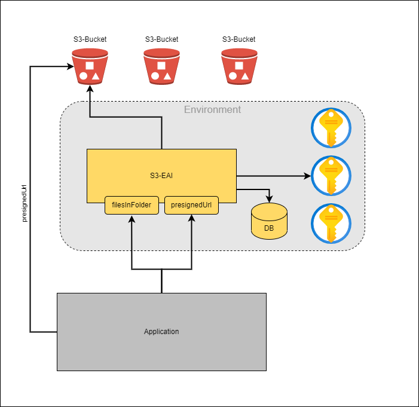
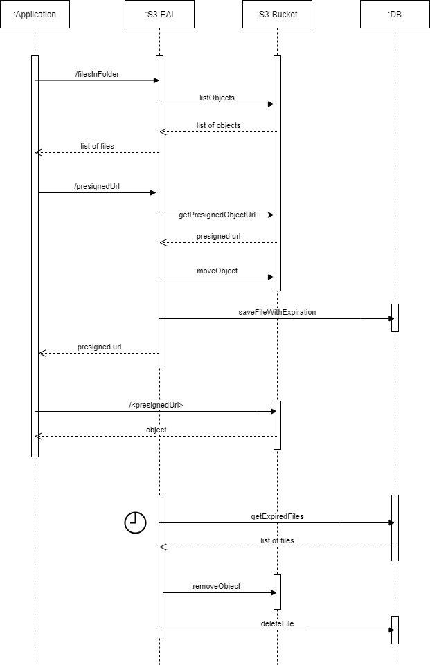

# Dokumentation

## Überblick



*Architektur*

Die Enterprise Application Integration Komponente (EAI) bietet eine Webschnittstelle, bei deren Aufruf im Hintergrund die vorliegenden Daten aus dem angegebenen S3-Bucket abgeholt und als verarbeitet gekennzeichnet werden können.

### Sequenzdiagramm für die S3-Integration



*Sequenzdiagramm*


Github-Repo:  https://github.com/it-at-m/mobidam-s3-eai

## API

| **API**            | **Beschreibung**                                              | **Parameter**                 |
|--------------------|---------------------------------------------------------------|-------------------------------|
| /api/filesInFolder | Auflisten aller Objekte im Bucket mit / ohne bestimmtem Path-Prefix | bucketName<br/>path           | 
| /api/presignedUrl  | Erstellen einer vorsignierten Url für ein Objekt im Bucket    | bucketName<br/>objectName<br/>path |
| /api/archive       | Archivieren eines Objektes im Bucket                          | bucketName<br/>objectName |

## Technisches Setup
## S3
Unser LHM S3 ist eine Implementierung von [StorageGrid](https://docs.netapp.com/us-en/storagegrid-family/).

Für das Projekt existiert ein S3 Tenant dem auf Antrag neue Buckets hinzugefügt werden können.
Jeder Bucket ist fachlich einer Schnittstelle zugeordnet.

Innerhalb des Buckets können Dateien mit einem 'Prefix' geordnet werden. Z. Bsp. 
- /Pfad1/Pfad1/Datei1
- /Pfad1/Pfad1/Datei2
- /Pfad1/Pfad2/Datei1
- ...

Bei einem 'Prefix' handelt es sich nicht um eine Pfad, sondern er ist besser als eine 'vorangestellte' Erweiterung des Dateinamens zu verstehen.

Es wird erwartet das Dateien immer mit einem 'Prefix' in einen S3 Bucket importiert werden. 
  
## Openapi
Um neue Openapi Java Source Dateien zu erstellen kann das Maven Profil _generate-openapi_ verwendet werden (mvn clean compile -P generate-openapi).
Das Profil erzeugt die Openapi Java Source Dateien im Maven _target_ Ordner.
Änderungen und neue Features können in die Klassen im Package _de.muenchen.mobidam.rest_ kopiert werden.

Die Openapi Quelle kann mit dem [Swagger Editor](https://editor.swagger.io) angezeigt und bearbeitet werden.
- Dazu den Swagger Editor mit dem Link im Browser starten.
- Die Openapi YAML aus [GitHub ...main/src/main/resources/openapi_rest_s3...yaml ](https://github.com/it-at-m/mobidam-s3-eai/blob/main/src/main/resources/) downloaden.
- Die Openapi YAML im Browser mit dem Swagger Editor über die Menü Punkte *File/Import file* öffnen.

## Security
Wird die EAI im Security Modus gestartet, muss der Aufrufer der REST Schnittstelle ein gültigen OAuth 2.0 Token mitliefern, sonst wird die Anfrage mit dem HTTP Status Code 401 "Unauthorized" abgelehnt.
Das gilt auch für einen abgelaufenen Token.

Zu Testzwecken kann ein Token bsp.weise mit curl vom SSO Provider bezogen werden :

curl \
-d "client_id=[client_id]" \
-d "client_secret=[client_secret]" \
-d "grant_type=client_credentials" \
"https://..."

# REST Schnittstelle
Mit dem [Swagger Editor](https://editor.swagger.io) kann die komplette [Openapi REST Beschreibung](https://github.com/it-at-m/mobidam-s3-eai/blob/sprint/src/main/resources/openapi_rest_s3_v1.yaml) angezeigt werden.
Der Workflow für den Import von Dateien in FME sieht folgende Schritt vor:
- Anzeigen von Inhalten eines S3 Buckets.
- Erzeugen eines Download Links für eine Datei.
- Nach dem Herunterladen und dem Import in FME verschieben der Datei in Archiv innerhalb des Buckets. Für alle Buckets ist 'archiv' ein festgelegter Prefix der in allen Buckets gleich ist. Beim Verschieben in das Archiv wird dem Objektnamen bestehend aus Prefix/Objektname das Prefix 'archiv' vorangestellt (s.u).
- Mit dem Verschiebn in das Bucket Archiv wird zusätzlich ein Datenbankeintrag mit einer Verfallsdauer der Datei geschrieben.
- Löschen der Datei aus dem S3 nach dem Ablauf der Verfalldauer.

## Anzeigen nicht verarbeiteter Dateien
Mit der Rest Ressource GET '.../filesInFolder?bucketName=bucket1&path=...[&archived=false]' können die Dateien mit einem bestimmten Prefix selektiert werden.

## Download von Dateien aus dem S3
Mit der REST Ressource '/presignedUrl' läßt sich ein zeitlich begrenzter Download Link für eine Datei aus einem S3 Bucket erstellen.
Z.Bsp. : GET '.../presignedUrl?bucketName=bucket1&objectName=Pfad1/Pfad2/Dateiname' 

## Archivieren und Anzeigen von bereits verarbeiteten Dateien
### Archivieren
Mit der Rest Ressource '/archive' lassen sich bereits in FME importierte Dateien in einen vordefinierten 'archiv' Pfad verschieben, damit sie nicht noch einmal verarbeitet werden.
Technisch ist das in S3 eine Erweiterung des Datei Pfads und Namens im S3 Bucket.
Z.Bsp. : PUT '.../archive?bucketName=bucket1&objectName=Pfad1/Pfad2/Datei' wird innerhalb des 'bucket1' verschoben nach 'archive/Pfad1/Pfad2/Datei'.

Für alle archivierten Dateien wird mit dem Verschieben in das '/archive' ein Datenbankeintrag mit einem Löschdatum erstellt.
Anhand des Datenbankeintrags werden die archivierten Dateien nach einer Frist automatisch aus dem S3 Bucket wieder gelöscht.

### Anzeigen
Mit der Rest Ressource GET '.../filesInFolder?bucketName=bucket1&path=...&archived=true' können die archivierten Dateien eines Pfades angezeigt werden.

### Konfiguration

Zur Konfiguration der Credentials der Buckets dient das Property ***mobidam.s3.bucket-credential-config***.
Dieses ist als Map gestaltet und enthält die default Tenant-Credentials. Nach Bedarf können der Access-Key und Secret-Key für die einzelnen Buckets separat konfiguriert werden:
```
tenant-default:
  access-key-env-var: MOBIDAM_ACCESS_KEY
  secret-key-env-var: MOBIDAM_SECRET_KEY
int-mdasc-mdasdev:
  access-key-env-var: MOBIDAM_BUCKET2_ACCESS_KEY
  secret-key-env-var: MOBIDAM_BUCKET2_SECRET_KEY
```
Die Umgebungsvariablen müssen entsprechend in der Laufzeitumgebung bereitgestellt werden:
```
MOBIDAM_ACCESS_KEY=<my-access-key1>
MOBIDAM_SECRET_KEY=<my-secret-key1>
MOBIDAM_BUCKET2_ACCESS_KEY=<my-access-key2>
MOBIDAM_BUCKET2_SECRET_KEY=<my-secret-key2>
```

# Archivierte Dateien aufräumen
Alle im S3 archivierten Dateien werden nach einer Ablauffrist automatisch über ihren Datenbankeintrag selektiert und wieder gelöscht. 

application.yaml:
```
mobidam:
  archive:
    expiration-months: 1
```

Die Löschzeitpunkte können konfiguriert werden.
application.yaml:
```
camel:
  route:
    delete-archive: quartz://mobidam/archiveCleanUp?cron=0+30+2+?+*+*

```

## S3 EAI Datenbank
Datenbankeintrag enthält Angaben zum
- Bucket
- Path/Objektname (z.Bsp. archive/Pfad1/Pfad2/Datei )
- Erstelldatum des Eintrags
- Ablaufdatum des Eintrags.

application.yaml:
```
spring:
  datasource:
    url: ...
    username: ...
    password: ...
    driver-class-name: ...

```